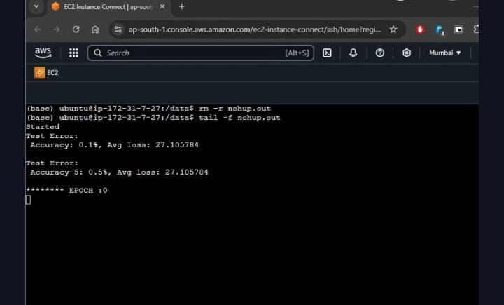
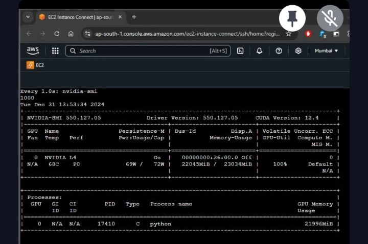

# ImageNet Classification with ResNet-50

This repository implements an ImageNet classification pipeline using a ResNet-50 model built from scratch with PyTorch. The project includes data preparation, training, evaluation, and utility scripts to streamline experimentation.

# ImageNet dataset

The ImageNet-1K dataset is a widely used benchmark in computer vision and deep learning research. It consists of 1,000 classes and approximately 1.2 million training images. The dataset also includes 50,000 validation images and is designed to challenge models with a diverse set of object categories, ranging from animals and plants to everyday objects and scenes.

# AWS setup

- Instance Type: AWS g6dn.8xlarge

- Storage: 500 GB EBS volume for dataset storage

- Training Configuration:

    - Batch size: 256

    - Epochs: 3

    - Training time per epoch: ~2 hours

- Results: Achieved 39.6% Top-1 accuracy and 66.0% Top-5 accuracy after 3 epochs.
  
  Note: We could run only 3 epochs as we were running out of time to exhaust our AWS credits. Can get better accuracy with more number of epochs.

# Model Architecture:

ResNet-50: Built with a total of 50 layers, consisting of initial 7x7 convolution and max pooling, 4 stages of bottleneck residual blocks (3, 4, 6, 3 blocks per stage),
Adaptive average pooling and a fully connected (FC) layer

Key Features:

- Residual Connections: Skip connections for efficient gradient flow.
- Bottleneck Design: Efficient 3-layer blocks (1x1, 3x3, 1x1 convolutions).
- Output: Predicts class probabilities (default: 1000 classes).
- Input Shape: 3-channel images (e.g., RGB) of size 224x224 or larger.
- Output Shape: Probability scores for the number of target classes.

# Model Training on EC2

# GPU Utilization on EC2

# Model Deployment:

HuggingFace 
https://huggingface.co/spaces/hotshotdragon/TSAI-Imagenet-Resnet

# Future Work:
- Training the model for more number of epochs and improving the accuracy

